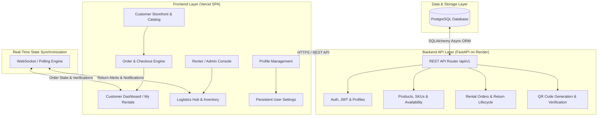

# ROVIA — Intelligent Rental Operations & Marketplace Platform

[](https://react.dev)
[](https://vitejs.dev)
[](https://tailwindcss.com)
[](https://fastapi.tiangolo.com)
[](https://www.postgresql.org)
[](https://vercel.com)
[](https://render.com)

> 🏆 **Built for the Odoo Hackathon 2026**

**ROVIA** is an enterprise-grade, multi-vendor rental marketplace and asset operations platform. Built for camera equipment, heavy machinery, luxury mobility, event logistics, and professional gear, ROVIA powers end-to-end rental lifecycles — from catalog discovery and escrow security deposit management to QR code handover verifications and real-time return queues.

## 🚀 Live Deployments

- **Frontend (Vercel)**: [https://rovia.vercel.app](https://rovia.vercel.app) *(Replace with your actual Vercel URL)*
- **Backend API (Render)**: [https://rovia-backend-pz8b.onrender.com](https://rovia-backend-pz8b.onrender.com)
- **API Documentation**: [https://rovia-backend-pz8b.onrender.com/docs](https://rovia-backend-pz8b.onrender.com/docs)

---

## 🏛️ System Architecture



---

## 🔄 End-to-End Application Workflow

```mermaid
sequenceDiagram
    autonumber
    actor Customer
    participant Frontend as ROVIA Frontend
    actor Renter as Renter / Admin
    participant Backend as FastAPI & PostgreSQL

    rect rgb(20, 25, 35)
        note right of Customer: Phase 1: Registration & Product Booking
        Customer->>Frontend: Register & Update Persistent Profile
        Customer->>Frontend: Browse Catalog & Select Product Dates
        Customer->>Frontend: Place Order (Simulated Instant Payment)
        Frontend->>Backend: Create Order, Reserve Asset & Generate ROV-Code
        Backend-->>Frontend: Order Status: DRAFT / CONFIRMED
    end

    rect rgb(25, 35, 25)
        note right of Renter: Phase 2: Approval & Handover Verification
        Renter->>Frontend: Review Order in Operations Dashboard
        Renter->>Frontend: Click "Approve Order"
        Frontend->>Backend: Transition Status -> READY_FOR_PICKUP
        Customer->>Frontend: View Invoice QR & Product Code
        Renter->>Frontend: Scan QR or Validate Product Code
        Frontend->>Backend: Verify Handover Token
        Backend-->>Frontend: Status -> PICKED_UP / ACTIVE
    end

    rect rgb(35, 25, 20)
        note right of Customer: Phase 3: Rental Period & Return Cycle
        Customer->>Frontend: Click "Request Return" from My Rentals
        Frontend->>Backend: Transition Status -> RETURN_DUE
        Backend->>Frontend: Send Real-Time Alert to Admin
        Renter->>Frontend: Inspect Item in Dashboard & Click "Complete Return"
        Frontend->>Backend: Transition Status -> RETURNED -> COMPLETED
        Backend-->>Customer: Notification: Rental Completed successfully!
    end
```



---

## ✨ Key Technical Features

### 🛍️ 1. Multi-Category Marketplace
- Browse highly curated products across categories (Cameras, Machinery, Fashion).
- Unique auto-generated `ROV-YYYY-XXXX` product codes for physical inventory tracking.
- Intelligent overlapping booking engine that auto-provisions physical assets if needed.

### 🛡️ 2. Role-Based Dashboards & Persistent Profiles
- **Role-based Authentication**: Redirection logic routes Admin/Renters to the Operations Console and Customers to the Storefront.
- **Persistent Profiles**: Edit user avatars, bio, phone, and addresses. Saved directly to the PostgreSQL database.

### 📱 3. Smart Verification & Logistics
- **QR Invoices**: Dynamic QR generation endpoint encoding product IDs, customer info, and secure token hashes.
- **Return Workflows**: Real-time multi-step return processes (Customer requests return $\rightarrow$ Admin verifies physical asset $\rightarrow$ Cycle closed).

---

## 🛠️ Tech Stack & Dependencies

- **Frontend**: React 18, Vite, TypeScript, TailwindCSS, Lucide Icons, Axios.
- **Backend**: FastAPI, Python 3.12, SQLAlchemy (Async), PostgreSQL, Pydantic (with `email-validator`), Alembic.
- **Infrastructure**: Vercel (Static SPA), Render (Dockerized Web Service + Managed PostgreSQL Database).

## 🚀 Local Development Setup

### Backend
```bash
cd backend
python -m venv venv
source venv/bin/activate  # (or `venv\Scripts\activate` on Windows)
pip install -r requirements.txt
alembic upgrade head
python scripts/seed.py
uvicorn app.main:app --reload --port 8000
```

### Frontend
```bash
cd frontend
npm install
# Ensure .env contains VITE_API_URL=http://localhost:8000/api/v1
npm run dev
```

---
*Developed for the Odoo Hackathon 2026.*
