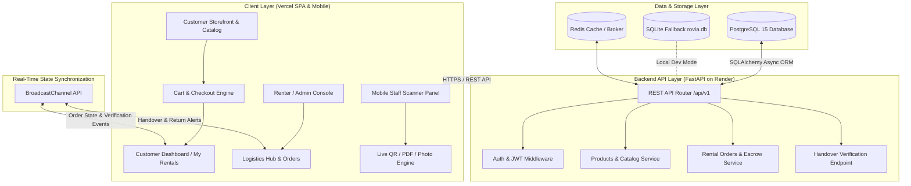

# ROVIA — Intelligent Rental Operations & Marketplace Platform

[](https://react.dev)
[](https://vitejs.dev)
[](https://tailwindcss.com)
[](https://fastapi.tiangolo.com)
[](https://www.postgresql.org)
[](https://vercel.com)
[](https://render.com)

**ROVIA** is an enterprise-grade, multi-vendor rental marketplace and asset operations platform. Built for camera equipment, heavy machinery, luxury mobility, event logistics, and professional gear, ROVIA powers end-to-end rental lifecycles — from catalog discovery and escrow security deposit management to mobile QR code handover verifications and real-time return collection queues.

---

## 🏛️ System Architecture



---

## 🔄 End-to-End Rental Workflow

```mermaid
sequenceDiagram
    autonumber
    actor Customer
    participant Storefront as ROVIA Storefront
    participant Scanner as Mobile Staff Scanner
    actor Renter as Renter / Logistics Staff
    participant Backend as FastAPI & Database

    rect rgb(20, 25, 35)
        note right of Customer: Phase 1: Product Selection & Booking
        Customer->>Storefront: Browse 300+ Products & Select Dates
        Customer->>Storefront: Place Order (Rental Fee + Security Deposit Escrow)
        Storefront->>Backend: Create Order & Generate QR Token (e.g. ROV-2026-566)
    end

    rect rgb(25, 35, 25)
        note right of Renter: Phase 2: Dispatch & Handover Verification
        Customer->>Renter: Show QR Code or PDF Invoice
        Renter->>Scanner: Open Scanner Panel (staff-scanner.html)
        Renter->>Scanner: Scan QR Code or Type Token Code
        Scanner->>Backend: POST /api/rentals/verify-handover
        Backend-->>Scanner: 200 OK — VERIFICATION PASSED
        Backend->>Storefront: Status: Active (Handed Over)
    end

    rect rgb(35, 25, 20)
        note right of Customer: Phase 3: Rental Period & Return Collection
        Customer->>Storefront: Click 'Return Product Now 📦' in My Rentals
        Storefront->>Renter: Broadcast Real-Time Return Notification
        Renter->>Storefront: Inspect Item & Click 'Accept Return & End Process ✓'
        Storefront->>Backend: Update Status: Completed & Escrow Deposit: Refunded
        Backend-->>Customer: Notification: Rental Completed & Deposit Refunded
    end
```



---

## ✨ Key Features

### 🛍️ 1. Multi-Category Marketplace Catalog
- **300+ Pre-Loaded Products** across 28 categories (Cameras, Drones, Heavy Machinery, Luxury Vehicles, Medical, Event Supplies, Designer Fashion, Tools, etc.).
- Search, filter by category, daily rate, and rental duration calculations.

### 📱 2. Minimalist Mobile Staff Scanner Panel (`/staff-scanner.html`)
- **Strict Contract Token Authorization**: Enforces regex-validated format (`ROV-YYYY-XXX`). Arbitrary or invalid tokens are rejected with a red **VERIFICATION REJECTED** alert.
- **Multi-Input Support**: Live Camera QR scanning, Image Photo upload, PDF Contract page rendering, and Manual Token Entry.
- **Manual Confirm Flow**: Staff reviews the pre-filled code before clicking **Verify**.

### 🚚 3. Real-Time Logistics Operations Hub
- **Pickups & Handover Queue**: Manages item dispatches and QR verification status.
- **Returns & Collection Queue**: Listens to customer return requests via `BroadcastChannel` in real time.
- **One-Click Settlement**: Renters accept returns, complete orders, and trigger automated security deposit refunds.

### 🔒 4. Escrow & Financial Management
- Dynamic security deposit calculation (5-10x daily rate held in escrow).
- Deposit tracking ledger, payouts manager, and dispute resolution module.

---

## 🛠️ Tech Stack

| Layer | Technology |
|---|---|
| **Frontend Framework** | React 18, TypeScript, Vite 5 |
| **Styling** | Vanilla CSS, TailwindCSS 3 (Obsidian / Dark Gold theme) |
| **Icons & Media** | Lucide React, HTML5-QRCode, PDF.js |
| **Backend API** | Python 3.11, FastAPI, Uvicorn |
| **Database** | PostgreSQL 15 (AsyncPG), SQLite (`rovia.db` fallback) |
| **ORM & Migrations** | SQLAlchemy 2.0 Async, Alembic |
| **Deployment** | Vercel (Frontend SPA), Render (FastAPI + Managed PostgreSQL) |

---

## 📁 Repository Structure

```
Rovia/
├── render.yaml                    # Render Blueprint config (FastAPI + PostgreSQL)
├── README.md                      # Complete System Documentation & Diagrams
├── .gitignore                     # Git exclusion rules
│
├── frontend/                      # React SPA Frontend
│   ├── vercel.json                # Vercel SPA rewrite & header rules
│   ├── package.json               # Dependencies & scripts
│   ├── vite.config.ts             # Vite bundler setup
│   ├── .env.example               # Frontend env template
│   ├── public/
│   │   └── staff-scanner.html     # Minimal Staff Handover Scanner Panel
│   └── src/
│       ├── App.tsx                # Main routing & state controller
│       ├── components/            # UI components, layout navbars, modals
│       ├── context/               # AuthContext & CartContext
│       ├── pages/
│       │   ├── customer/          # Storefront, Catalog, MyRentals, Checkout
│       │   └── admin/             # Dashboard, Logistics Hub, Products, Orders
│       └── services/
│           ├── api.ts             # Primary frontend API data layer
│           ├── apiClient.ts       # Authenticated REST client
│           ├── mockData.ts        # Base schema interfaces & initial data
│           └── productsData.ts    # 300+ Product catalog dataset
│
└── backend/                       # FastAPI Backend
    ├── requirements.txt           # Python dependencies
    ├── app/
    │   ├── main.py                # FastAPI entry point & CORS configuration
    │   ├── core/
    │   │   ├── config.py          # Environment settings (PostgreSQL / SQLite)
    │   │   └── database.py        # SQLAlchemy Async engine
    │   ├── products/              # Product router, schemas, & models
    │   └── rentals/
    │       └── handover_verification.py  # Handover verification API
    └── rovia.db                   # SQLite database (Local dev fallback)
```

---

## 🚀 Quickstart & Local Setup

### 1. Prerequisites
- Node.js `v18+` & `npm`
- Python `3.10+`

### 2. Run Backend
```bash
cd backend
pip install -r requirements.txt
python -m uvicorn app.main:app --host 0.0.0.0 --port 8000 --reload
```
> API Docs available at `http://localhost:8000/docs`

### 3. Run Frontend
```bash
cd frontend
npm install
npm run dev
```
> Web App available at `http://localhost:3000`  
> Mobile Staff Scanner available at `http://localhost:3000/staff-scanner.html`

---

## ☁️ Production Deployment Guide

### Deploy Backend to Render
1. Push repo to GitHub.
2. Open **[Render Dashboard](https://dashboard.render.com)** → New **Blueprint**.
3. Select repo `sakthisundar-16/Rovia` → Render will auto-detect `render.yaml`.
4. Click **Apply** to spin up **PostgreSQL 15** and the **FastAPI Web Service**.

### Deploy Frontend to Vercel
1. Open **[Vercel Dashboard](https://vercel.com)** → **Add New Project**.
2. Select repo `sakthisundar-16/Rovia`.
3. Set **Root Directory** to `frontend`.
4. Add Environment Variable:
   - `VITE_API_URL` = `https://your-render-backend.onrender.com/api/v1`
5. Click **Deploy**.

---

## 📄 License & Attribution

Designed and engineered for **ROVIA Rental Operations Platform**.
