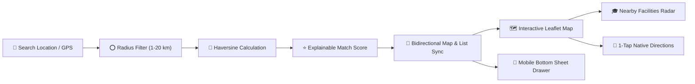
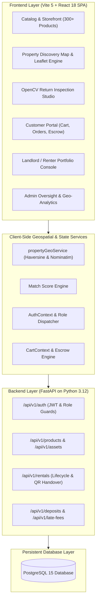
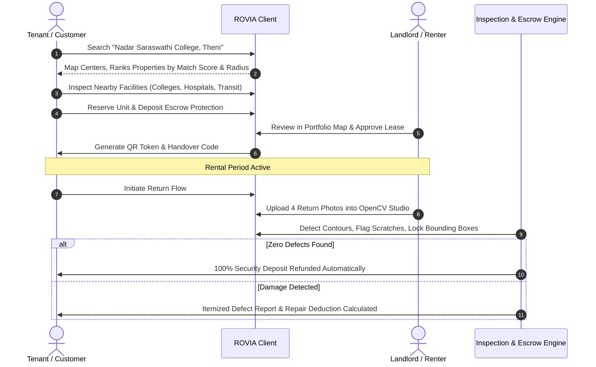

<div align="center">

# 🏛️ ROVIA — Universal Rental Operations & Property Intelligence

### *Next-Generation Multi-Vendor Marketplace • OpenCV Computer Vision Inspection • Geospatial Intelligence*

[](https://rovia.vercel.app)
[](https://react.dev)
[](https://vitejs.dev)
[](https://openstreetmap.org)
[](https://fastapi.tiangolo.com)
[](https://www.postgresql.org)
[](https://tailwindcss.com)

<p align="center">
  <b>ROVIA</b> is a production-grade, enterprise rental ecosystem combining an <b>Amazon &amp; Flipkart-inspired storefront</b>, an <b>OpenCV-powered Computer Vision damage detection studio</b>, and a <b>geospatial property discovery &amp; intelligence engine</b> with interactive radius filtering, college proximity radars, landlord portfolio tracking, and admin geographic oversight.
</p>

[Explore Discovery Map](#-map-based-property-discovery--intelligence) • [OpenCV Inspection](#-opencv-computer-vision-damage-verification) • [Architecture](#-system-architecture) • [Quick Start](#-quick-start-guide) • [Mobile Experience](#-mobile-first-experience)

---

</div>

## 🌟 Highlights at a Glance

| Feature Category | Core Capabilities | Technology |
| :--- | :--- | :--- |
| 🗺️ **Geospatial Discovery** | Radius filtering (1–20 km), College/PIN geocoding, Nearby facility radar, Explainable match score | **Leaflet**, **OpenStreetMap**, **Haversine Engine** |
| 👁️ **Computer Vision Return** | 360° multi-angle defect segmentation, Split-curtain comparator, Escrow auto-deductions | **OpenCV Detection**, **Canvas API** |
| 🛍️ **Universal Marketplace** | 300+ products across 30+ categories, 4-angle product creation wizard, Flipkart/Amazon UX | **React 18**, **TypeScript**, **Tailwind 3** |
| 🛡️ **Role Governance** | Tri-portal routing (Customer / Landlord-Renter / Administrator), QR handover verifications | **Context API**, **JWT Authentication** |
| 📱 **Mobile Responsive** | Draggable bottom sheet drawer, floating view switcher (`Map 🗺️` $\leftrightarrow$ `List 📋`), touch-optimized | **Tailwind Flex/Grid**, **Touch Gestures** |

---

## 🗺️ Map-Based Property Discovery & Intelligence

ROVIA features a fully interactive, 100% open-source mapping system powered by **Leaflet** and official **OpenStreetMap** standard tiles (strictly **Zero API Key Required**). It enables tenants to discover verified properties, inspect neighborhood infrastructure, and evaluate personalized match scores in real time.



<details open>
<summary><b>🔍 1. Intelligent Location Search &amp; Geocoding</b></summary>

- **Benchmark Geocoding**: Instant, zero-latency fuzzy matching for Indian towns, educational institutions, and landmarks (e.g. *Nadar Saraswathi College, Vadapudupatti, Allinagaram, Theni New/Old Bus Stand, Madurai Road, PIN 625531*) with graceful OpenStreetMap Nominatim fallback.
- **"Near Me" GPS Geolocation**: Browser Geolocation API integration with loading indicators, accuracy circle, and helpful permission alerts.
- **One-Tap Landmark Chips**: Quick discovery pills for popular local landmarks on mobile and desktop.
</details>

<details open>
<summary><b>🎯 2. Explainable Property Match Score</b></summary>

Unlike black-box algorithms, ROVIA transparently explains *why* a property scored **87%–96% Match**:
- 🟢 *Within your monthly budget (₹12,500/mo)*
- 🟢 *Only 0.35 km from Nadar Saraswathi College (<5 min walk)*
- 🟢 *100% Full Power Backup &amp; Covered Parking Included*
- 🟢 *Verified Landlord Partner listing*
- 🟡 *Alerts if deposit exceeds preference or pet rules differ*
</details>

<details open>
<summary><b>🏥 3. Nearby Facilities &amp; Proximity Radar</b></summary>

Interactive category toggles with real walking/driving time estimates:
- 🎓 **Colleges &amp; Schools**: Nadar Saraswathi College of Arts &amp; Science (0.35 km), Engineering College (0.4 km)
- 🏥 **Hospitals &amp; Health**: Theni Govt Medical College Hospital (2.8 km), City Hospital (1.2 km)
- 🚌 **Transit Hubs**: Theni New Bus Stand (2.1 km), Vadapudupatti Stop (0.15 km)
- 🛒 **Retail &amp; Markets**: Reliance Smart Point (0.6 km), Daily Bazaars (0.7 km)
- 🏦 **Banks &amp; ATMs**: Canara Bank &amp; SBI (0.4 km)
- 💊 **Pharmacies**: MedPlus &amp; Apollo Pharmacy (0.5 km)
</details>

<details>
<summary><b>🏢 4. Landlord Portfolio Map &amp; Admin Geo-Analytics</b></summary>

- **Landlord Portfolio View**: Geographic map color-coded by real-time status:
  - 🟢 **Occupied (Emerald)**: Active tenant details, lease expiration countdown, 1-tap phone call.
  - ⚫ **Available (Charcoal)**: Listing inquiries, daily rates, direct promotion link.
  - 🟠 **Under Maintenance (Amber)**: Work order description, vendor name, target completion date.
- **Admin Geographic Oversight**: Regional density view, locality yield comparison table, average rent per sq.ft., and vacancy rates across regional clusters.
</details>

---

## 👁️ OpenCV Computer Vision Damage Verification

ROVIA solves the critical friction point in rentals: **security deposit disputes and return damage assessment**.

```
[Customer Return] ──▶ [4-Angle High-Res Upload] ──▶ [OpenCV Contour Extraction]
                                                            │
                     ┌──────────────────────────────────────┴──────────────────────────────────────┐
                     ▼                                                                             ▼
          [Structural Defect Bounding Boxes]                                           [Split Curtain Comparator]
         - Scratch #1 (94.8% confidence)                                              - 100% Return Photo Overlay
         - Dent #2 (88.3% confidence)                                                 - 50/50 Dual Synchronized Split
         - Permanent Z-Index Lock                                                     - 100% Baseline Handover Photo
                     │                                                                             │
                     └──────────────────────────────────────┬──────────────────────────────────────┘
                                                            ▼
                                        [Automated Escrow Settlement Engine]
                                    - Clean Return: 100% Deposit Refunded
                                    - Damaged Return: Pro-rated Repair Deduction
```

- **Permanent Defect Highlighting**: Defect bounding boxes remain persistently locked on screen with confidence badges.
- **Single-Angle &amp; 360° Scans**: Scan current angle on demand or trigger automated multi-angle audit.
- **Split Curtain Slider**: Slide between original handover baseline and returned asset photo with 1-click preset buttons (`100% Return`, `50/50`, `100% Baseline`).

---

## 📱 Mobile-First Experience

ROVIA is engineered for frictionless touch interaction across smartphones, tablets, and desktops:

<div align="center">

```
┌──────────────────────────────────────┐
│  ROVIA Discover          [Near Me 📍]│
│  [ Search college, city, PIN...    ] │
│  [1km] [2km] [5km*] [10km] [20km]    │
├──────────────────────────────────────┤
│                                      │
│          🗺️ INTERACTIVE MAP          │
│       [₹12.5k]                       │
│                   [₹21k]             │
│        (📍 0.35 km)                  │
│                                      │
│       [ Map View 🗺️ | List (8) 📋 ]   │ ◀ Floating Pill FAB
├──────────────────────────────────────┤
│ ┌──────────────────────────────────┐ │
│ │ 🏠 Emerald Palms 2 BHK    [96%⭐]│ │
│ │ ₹12,500/mo • 0.35 km from College│ │ ◀ Swipeable Bottom Sheet
│ │ [ Directions ]   [ View Details ]│ │
│ └──────────────────────────────────┘ │
└──────────────────────────────────────┘
```

</div>

- **Floating View FAB**: Switch between **Map View 🗺️** and **List View 📋** with a single thumb tap.
- **Slide-Up Bottom Sheet**: Selecting any pin on the map elevates an instant preview card without navigating away.
- **Touch-Friendly Filters**: Horizontal scrolling chips for radius, property types, and amenities.
- **Full-Screen Modal Inspector**: High-res photo gallery with swipe buttons, utility specifications, and direct Google Maps navigation.

---

## 🏛️ System Architecture



---

## 🔄 User Journey & Rental Lifecycle



---

## 🚀 Quick Start Guide

### Prerequisites
- **Node.js** $\ge$ 18.x
- **npm** $\ge$ 9.x
- **Python** $\ge$ 3.10 (for backend API)
- **PostgreSQL** (optional for local DB; frontend includes offline storage mode)

### 1. Clone the Repository
```bash
git clone https://github.com/sakthisundar-16/Rovia.git
cd Rovia
```

### 2. Launch Frontend (Zero Configuration Required)
```bash
cd frontend
npm install
npm run dev
```
Open [http://localhost:5173](http://localhost:5173) in your browser.

### 3. Launch Backend (Optional)
```bash
cd backend
python -m venv venv

# Windows:
venv\Scripts\activate
# Linux/macOS:
source venv/bin/activate

pip install -r requirements.txt
uvicorn app.main:app --reload --port 8000
```

---

## 🔑 Demo Access & Role Switching

ROVIA includes a built-in instant role switcher in the navigation bar to test all personas:

| Persona | Access Method | Key Workflows to Explore |
| :--- | :--- | :--- |
| **Tenant / Customer** | Default mode or click *"Storefront"* | Browse 300+ products, explore **Property Discovery Map**, calculate commute times to Nadar Saraswathi College, place orders. |
| **Landlord / Renter** | Switch role to *"Renter"* | Open **Portfolio Map** to inspect occupied vs available units, manage lease expiries, launch **OpenCV Return Verification**. |
| **Administrator** | Switch role to *"Admin"* | Open **Geo Analytics** to review regional density, inspect locality average rent, arbitrate disputes, monitor late fees. |

---

## 📂 Project Structure

```
Rovia/
├── frontend/
│   ├── src/
│   │   ├── components/
│   │   │   ├── map/                     # 🗺️ Property Intelligence Module
│   │   │   │   ├── MapView.tsx          # Leaflet container, custom pins & radius circle
│   │   │   │   ├── MapSearch.tsx        # Geocoding autocomplete & "Near Me" GPS
│   │   │   │   ├── MapFilters.tsx       # Dynamic radius, BHK, budget & amenity filters
│   │   │   │   ├── NearbyFacilities.tsx # Proximity radar (Colleges, Hospitals, Transit)
│   │   │   │   ├── PropertyMatchScore.tsx # Explainable score breakdown
│   │   │   │   ├── PropertyMapCard.tsx  # Synchronized property preview cards
│   │   │   │   └── PropertyDetailModal.tsx # Full-screen modal inspector
│   │   │   └── layout/                  # Responsive Customer, Renter & Admin Navbars
│   │   ├── pages/
│   │   │   ├── customer/
│   │   │   │   ├── PropertyDiscoveryMap.tsx # Customer Map Discovery page
│   │   │   │   ├── Catalog.tsx          # Flipkart/Amazon multi-category catalog
│   │   │   │   ├── ProductDetail.tsx    # 4-angle gallery & booking matrix
│   │   │   │   └── Landing.tsx          # Public immersive landing page
│   │   │   ├── renter/
│   │   │   │   └── LandlordPortfolioMap.tsx # Landlord portfolio status map
│   │   │   └── admin/
│   │   │       ├── AdminGeoAnalytics.tsx # Regional density & locality yield analysis
│   │   │       ├── PickupReturn.tsx     # OpenCV damage verification studio
│   │   │       └── Dashboard.tsx        # Operations & orders overview
│   │   ├── services/
│   │   │   ├── propertyGeoService.ts    # Haversine distance, geocoding & benchmark data
│   │   │   ├── api.ts                   # Unified API & offline sync
│   │   │   └── productsData.ts          # 300+ curated products dataset
│   │   └── types/
│   │       └── propertyTypes.ts         # TypeScript models for property intelligence
├── backend/
│   ├── app/
│   │   ├── main.py                      # FastAPI application entrypoint
│   │   ├── rentals/                     # Order lifecycle & state machines
│   │   ├── products/                    # Product matrix & SKU generation
│   │   └── auth/                        # JWT authentication & security
│   └── alembic/                         # Database schema migrations
└── README.md
```

---

## 🤝 Contributing & Hackathon Accreditation

- Developed by **Sakthi Sundar** &amp; the ROVIA Team.
- Built for the **Odoo x Adamas University Hackathon 2026**.
- Remote Repository: [https://github.com/sakthisundar-16/Rovia](https://github.com/sakthisundar-16/Rovia)

<div align="center">

**[⬆ Back to Top](#-rovia--universal-rental-operations--property-intelligence)**

</div>
